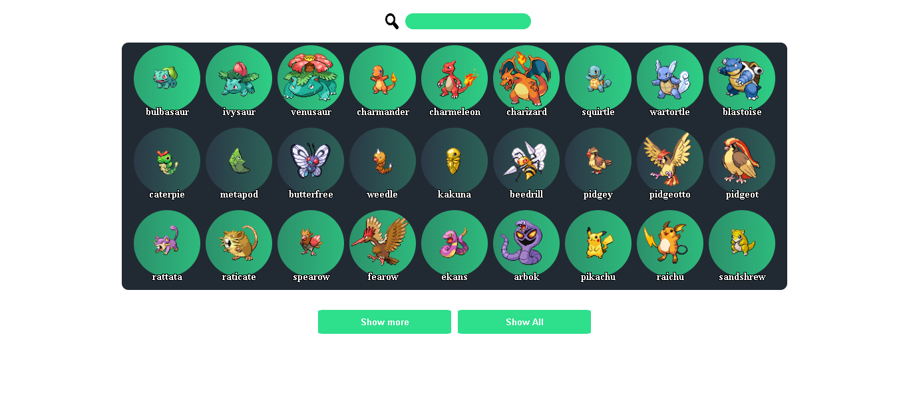

# Pokedex
<p align="center">Obtém os nomes e as imagens dos primeiros 151pokemons. Aprendi sobre como consumir API e funções assync/await.</p>
<h4 align="center"> Status do projeto: Em contrução</h4>

### Tabela de conteudo

<p align="center">
<a href="#funcionalidades">funcionalidades</a> • 
<a href="#Demostração-da-Aplicação">Demostração</a> • 
<a href="#Como-executar-o-projeto">como Executar</a> • 
<a href="#Tecnologias-utilizadas">Tecnologias</a> •   
<a href="#autor">Autor</a> •
<a href="#licenc-a">Licença</a> 
</p>

### funcionalidades

- [x] pokeApi 
- [x] Designer básico
- [x] Barra de Pesquisa
- [ ] Atualizar designer
- [ ] consumir informações mais completas dos pokemons
- [ ] otimizar a requisição da api 

### Demostração da Aplicação
* Barra de pesquisa: Faz uma pesquisa pelo nome do pokemon.
* Show more : Mostra os próximos 9 pokemons.
* Show all : Mostra todos os pokemons.
<br><a href="https://bsantuz.github.io/pokedex/">Teste a aplicação</a>


### Como executar o projeto
Antes de começar, você vai precisar ter instalado em sua máquina um editor para trabalhar com o código como [VSCode](https://code.visualstudio.com/)

```bash
# Clone este repositório
$ git clone <>

# Acesse a pasta do projeto no terminal/cmd
$ cd ...

# Execute a aplicação 
$ index.html ou server live(plugin do vscode)

```
            

### Tecnologias utilizadas

* Front end basic( html,  css, js))

### Autor
Feito com ❤️ por Bruno Santuz 👋🏽 Entre em contato!

email: brunobruno2000@hotmail.com

### Licença
MIT License

